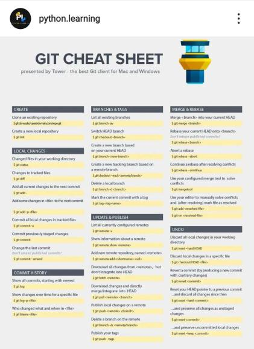

# ITE@UIUC Opensource
Opensource resources for ITE@UIUC. All the useful resources used to study for **engineering** and **computer science** courses. Courses include from **Civil & Environmental Engineering, Computer Science** and more.
 
## Contributors:
- **Louis Sungwoo Cho 조성우**
  
## Git Commands:

    git pull
    git add .
    git commit -m "commiting files to my GitHub repository"
    git push origin main
    
### Git Commit Conflict

    del .git\index.lock
    
# ALL PYTHON STUFF:
 - ## Introduction to Python
   - **[0] [Python Programming Tutorials](https://pythonprogramming.net/)**
   - **[1] [Corey Schafer Introductory Python Tutorial](https://youtube.com/playlist?list=PL-osiE80TeTt2d9bfVyTiXJA-UTHn6WwU)**
   - **[2] [Tech with Tim Object-Oriented Programming in Python](https://www.youtube.com/watch?v=JeznW_7DlB0)**
   - **[3] [Tech with Tim Pygame Tutorial](https://www.youtube.com/watch?v=jO6qQDNa2UY)**
 - ## Data Structures in Python
   - **[0] [Jovian Introductory Data Structures & Algorithms Python Tutorial](https://youtu.be/pkYVOmU3MgA)**
 - ## Algorithms in Python
   - **[0] Scroll down to CS 374**
   - **[1] [Tech with Tim A* Visualizer](https://www.youtube.com/watch?v=JtiK0DOeI4A)**
 - ## Data Science & Analytics in Python
   - **[0] [Mr. P Solver SciPy Tutorial](https://www.youtube.com/watch?v=jmX4FOUEfgU)**
   - **[1] [Time-Series Windows 10 Prophet Installation](https://stackoverflow.com/questions/53178281/installing-fbprophet-python-on-windows-10)**
   - **[2] [Time-Series Prophet Stuff](https://facebook.github.io/prophet/docs/quick_start.html)**
   - **[3] [Plotly Documentation](https://plotly.com/nodejs/)**
   - **[4] [Professor Wade Fagen-Ulmschneider and Karlie Flanagan's guide to Data Science with Python](https://discovery.cs.illinois.edu/learn/)**

 - ## System Programming in Python
   - **[0] [Tech with Tim Python Socket Programming](https://www.youtube.com/watch?v=3QiPPX-KeSc)**

 
- ## 파이썬 한국어 버전 (Korean Version for Python)
   - **[0] [나도코딩 파이썬 기초](https://www.youtube.com/watch?v=kWiCuklohdY)**
   - **[1] [GongbroDesk 파이썬 기초](https://www.youtube.com/watch?v=8_VWnRvbGPs)**

## UIUC Grainger College of Engineering Courses

### Legend:
  - **CEE: Civil & Environmental Engineering**
  - **CS: Computer Science**
  - **ECE: Electrical & Computer Engineering**
  - **ME: Mechanical Engineering**
  - **AE: Aerospace Engineering**
  - **SE: Systems Engineering & Design**
  - **IE: Industrial Engineering**
  - **TAM: Theoretical & Applied Mechanics**
  - **MSE: Materials Science & Engineering**
  - **MATH: Mathematics**
  - **STAT: Statistics**
  - **PHYS: Physics**
  - **CHEM: Chemistry**

### Civil & Environmental Engineering (Transportation):
- **CEE 515 Traffic Flow Theory (0.00)**
  - **[0] [Traffic Flow Tutorial](https://www.youtube.com/playlist?list=PLE1KZPAxQX-iaayoOr1rtWwIr1KF44FOy)**
- **CEE 498 Learning Methods for CEE (0.00)**
  - **[0] TBA**
- **CEE 412 High-speed Rail Engineering (1.00)**
  - **[0] TBA**
- **CEE 407 Airport Design (2.00)**
- **CEE 415 Geometric Design of Roads (3.00)**
  - **[0] [Simmy Sigma Advanced Geomatics Start from Video 5](https://www.youtube.com/playlist?list=PLSlqN4CMG7zws3w36FnSVGn912WU4mjiJ)**
  - **[1] [FE Exam Transportation](https://www.youtube.com/watch?v=us26CSISYHE)**
- **CEE 416 Traffic Capacity Analysis (1.50)**
  - **[0] [Ali Hajbabaie Traffic Engineering](https://youtube.com/playlist?list=PLneifN52CCdu_uMCA-R6zHD_1YYxVS0Oe)**
  - **[1] [Meead Saberi Traffic Engineering](https://www.youtube.com/user/meeadsk/videos)**
  - **[2] [Shockwave Example](https://www.youtube.com/watch?v=9QFy9iREWsY)**
  - **[3] [Freeway Analysis](https://www.youtube.com/watch?v=vvFC4gyw81A)**
- **CEE 418 Public Transportation Systems (1.00)**
  - **[0] [MIT Public Transportation Systems](https://youtube.com/playlist?list=PLUl4u3cNGP62AU7iNniqVoMl8C64tIOVk)**
- **CEE 310 Transportation Engineering (1.00)**
  - **[0] [Fundamentals of Transportation](https://en.wikibooks.org/wiki/Fundamentals_of_Transportation)**
  - **[1] [Professor Lewis Lehe Transportation Engineering Website](https://trafficvis.com/)**
  - **[2] [Louis Sungwoo Cho's Computational Transportation Science](https://github.com/lotlouischoitslab/Transportation_Engineering)**
- **CEE 320 Construction Engineering (1.50)** 
  - **[0] [Project Management for Construction](https://www.cmu.edu/cee/projects/PMbook/)**
  - **[1] [Engineer4Free Project Management](https://youtube.com/playlist?list=PLOAuB8dR35oeyKU0ojIxD8Muf6Mwc8ugW)**
  - **[2] [Critical Path Method in Python](https://pypi.org/project/criticalpath/)**
- **CEE 350 Water Resources Management (1.30)**
  - **[0] [Civil PE Problems Water Resources](https://youtube.com/playlist?list=PLpA54wtDMrA17xKC9s_M7G3mYU1PKXsC0)**
- **CEE 360 Structural Engineering (0.50)**
  - **[0] [Structures Free Structural Analysis](https://youtube.com/playlist?list=PL1DE2AA99E4258070)**
- **CEE 300 Behavior of Materials (1.00)**
  - **[0] [Dragos Andrei Civil Engineering Materials](https://github.com/lotlouischoitslab)**
- **CEE 201 Civil & Environmental Systems Engineering & Economics**
  - **[0] [Engineer4Free Engineering Economics Tutorial](https://youtube.com/playlist?list=PLOAuB8dR35oeZR8OexafgBb0Y-nE3QqCP)**
  - **[1] [Yong Wang's Operation Research](https://youtube.com/playlist?list=PLgA4wLGrqI-ll9OSJmR5nU4lV4_aNTgKx)**
- **CEE 202 Engineering Uncertainty & Risk**
  - **[0] Refer STAT 400 Statistics & Probability 1 Notes**

### Computer Science (Artificial Intelligence & Big Data):

- **CS 124 Introduction to Computer Science 1 Java**
   - **[0] [Tech with Tim Java Programming Tutorial](https://www.youtube.com/watch?v=Yv_4RXyLjL8)**
   - **[1] [Kunal Kushwaha Java OOP Tutorial](https://youtube.com/playlist?list=PL9gnSGHSqcno1G3XjUbwzXHL8_EttOuKk)**
   - **[2] [Dinesh Varyani Java DSA Tutorial](https://youtube.com/playlist?list=PL6Zs6LgrJj3tDXv8a_elC6eT_4R5gfX4d)**
   - **[3] [Learn Java/Kotlin Online](https://www.learncs.online/)**
- **CS 128 Introduction to Computer Science 2 C++**
  - **[0] [FreeCodeCamp C++ Tutorial](https://www.youtube.com/watch?v=8jLOx1hD3_o)**
  - **[1] [CodeBeauty C++ Tutorial](https://www.youtube.com/watch?v=GQp1zzTwrIg)**
  - **[2] [Learn C++ in 31 Hours](https://www.youtube.com/watch?v=8jLOx1hD3_o&t=40906s)**
  - **[3] [Learn C++ Online](https://learncpp.online/lessons)**
- **CS 173 Discrete Structures**
  - **[0] [Kimberly Brehm Discrete Math Part 1](https://youtube.com/playlist?list=PLl-gb0E4MII28GykmtuBXNUNoej-vY5Rz)**
  - **[1] [Kimberly Brehm Discrete Math Part 2](https://youtube.com/playlist?list=PLl-gb0E4MII0sGLCJeqDB3y63HZ6lM5LJ)**
  - **[2] [CS 173 Practice Materials](https://courses.grainger.illinois.edu/cs173/sp2019/A-lecture/Exams/index.html)**
  - **[3] [Jongwoo Jeon's Discrete Mathematics Wiki](https://github.com/jongwoojeff/DiscreteMathematics/wiki)**
- **CS 225 Data Structures & Software Principles C++**
  - **[0] [MyCodeSchool C++ DSA Tutorial](https://www.youtube.com/watch?v=B31LgI4Y4DQ)**
  - **[1] [Abdul Bari DSA](https://youtube.com/playlist?list=PLDN4rrl48XKpZkf03iYFl-O29szjTrs_O)**
  - **[2] [Fit Coder C++ Graphs Tutorial](https://youtube.com/playlist?list=PLFj4kIJmwGu3m30HfYDDufr3PZBfyngr0)**
- **CS 357 Numerical Methods 1 Python**
   - **[0] [Professor Mariana Silva CS 357 Spring 2022](https://courses.grainger.illinois.edu/cs357/sp2022/)**
   - **[1] REFER TO MY PYTHON STUFF ABOVE**
- **CS 374 Introduction to Algorithms & Models of Computation**
  - **[UIUC CS/ECE 374A Spring 2018 Professor Jeff Erickson Homepage](https://courses.engr.illinois.edu/cs374/sp2018/A/)**
  - **[UIUC CS/ECE 374A Spring 2018 Professor Jeff Erickson Schedule](https://courses.engr.illinois.edu/cs374/sp2018/A/schedule.html)**
  - **[UIUC CS/ECE 374A Professor Jeff Erickson Recommended Resources](https://courses.engr.illinois.edu/cs374/sp2021/resources.html)**
  - **[UIUC CS/ECE 374B Professor Nickvash Kani](https://ecealgo.com/)**
  - **[MIT 6.006 Introduction to Algorithms Fall 2011](https://youtube.com/playlist?list=PLUl4u3cNGP61Oq3tWYp6V_F-5jb5L2iHb) (STRONGLY RECOMMEND!)**
  - **[MIT 6.006 Introduction to Algorithms Fall 2011 Notes](https://ocw.mit.edu/courses/6-006-introduction-to-algorithms-fall-2011/pages/lecture-notes/) (STRONGLY RECOMMEND!)**
  - **[MIT 6.006 Introduction to Algorithms Spring 2020](https://youtube.com/playlist?list=PLUl4u3cNGP63EdVPNLG3ToM6LaEUuStEY) (STRONGLY RECOMMEND!)**
  - **Algorithms**
    - **[0] [NeetCode Website](https://www.youtube.com/c/NeetCode)**
    - **[1] [Kunal Kushwaha Recursion Tutorial](https://youtube.com/playlist?list=PL9gnSGHSqcnp39cTyB1dTZ2pJ04Xmdrod)**
    - **[2] [Lynn Zheng Backtracking Tutorial](https://www.youtube.com/watch?v=A80YzvNwqXA)**
    - **[3] [Andrey Greyhov Dynamic Programming Tutorial](https://youtube.com/playlist?list=PLVrpF4r7WIhTT1hJqZmjP10nxsmrbRvlf)**
    - **[4] [NeetCode Dynamic Programming Tutorial](https://youtube.com/playlist?list=PLot-Xpze53lcvx_tjrr_m2lgD2NsRHlNO)**
    - **[5] [Graph Theory from Google Software Engineer](https://www.youtube.com/watch?v=09_LlHjoEiY)**
    - **[6] [NeetCode Graph Algorithms](https://youtube.com/playlist?list=PLot-Xpze53ldBT_7QA8NVot219jFNr_GI)**
  - **Models of Computation**
    - **[0] [Easy Theory Theory of Computation](https://youtube.com/playlist?list=PLylTVsqZiRXN3Q86XJV6OWOmIzvVZs75E)**
    - **[1] [Neso Academy Theory of Computation & Automata Theory](https://youtube.com/playlist?list=PLBlnK6fEyqRgp46KUv4ZY69yXmpwKOIev)**
  - **Algorithms & Models of Computation Reduction & NP-Completeness**
    - **[0] [Professor Painter NP-Completeness Tutorial](https://youtube.com/playlist?list=PLQfaHkBRINsxngvO_CIM74kUauPd-BGa3)**
  - **Optional**
    - **[0] [Professor Jeff Erickson's CS 473 Advanced Algorithms Spring 2020](https://courses.engr.illinois.edu/cs473/sp2020/lectures.html)**
  
### ARTIFICIAL INTELLIGENCE COURSES 
- **CS 440 Artificial Intelligence **
   - **[0] [UC Berkeley Artificial Intelligence](http://aima.cs.berkeley.edu/)**
   - **[1] [UC Berkeley CS 188 Artificial Intelligence Playlist](  https://youtube.com/playlist?list=PLsOUugYMBBJENfZ3XAToMsg44W7LeUVhF)**
  
- **CS 441 Applied Machine Learning**
   - **[0] [Kylie Ying Introduction to Machine Learning](https://www.youtube.com/watch?v=i_LwzRVP7bg)**
   - **[1] [Codebasics Machine Learning Tutorial](https://youtube.com/playlist?list=PLeo1K3hjS3uvCeTYTeyfe0-rN5r8zn9rw)**
   - **[2] [Derek Banas Time Series Forecasting Tutorial](https://www.youtube.com/watch?v=_4cpUXTUoXk&t=595s)**
   - **[3] [DigitalSreeni Time-Series Forecasting](https://www.youtube.com/watch?v=tepxdcepTbY)**
   - **[4] [CS 441 Applied Machine Learning Spring 2023 Professor Derek Hoeim](https://courses.engr.illinois.edu/cs441/sp2023/)**

- **CS 443 Reinforcement Learning**
   - **[0] [Skowster the Geek Reinforcement Learning](https://www.youtube.com/playlist?list=PLWzQK00nc192L7UMJyTmLXaHa3KcO0wBT)**
   - **[1] [Stanford CS 234 Reinforcement Learning](https://www.youtube.com/playlist?list=PLoROMvodv4rOSOPzutgyCTapiGlY2Nd8u)**
   - **[2] [Reinforcement Learning Full Tutorial in Python](https://www.youtube.com/watch?v=ELE2_Mftqoc&t=4018s)**
   - **[3] [Tutorials Muster Reinforcement Learning](https://www.youtube.com/playlist?list=PLQyWwjpavAmGrpyfnR28Kqeq_VV2xeV00)**
   - **[4] [Deeplizard Reinforcement Learning](https://youtube.com/playlist?list=PLZbbT5o_s2xoWNVdDudn51XM8lOuZ_Njv)**
   - **[5] [Nicholas Renotte RL Tutorial](https://www.youtube.com/watch?v=Mut_u40Sqz4&t=3606s)**
   - **[6] [Andreas Geiger Self-Driving Cars](https://youtube.com/playlist?list=PL05umP7R6ij321zzKXK6XCQXAaaYjQbzr)**

- **CS 444 Deep Learning for Computer Vision**
   - **[0] [Stanford CS 231N Deep Learning for Computer Vision](http://cs231n.stanford.edu/schedule.html)**
   - **[1] [Stanford CS 231N Deep Learning for Computer Vision Youtube](https://youtube.com/playlist?list=PLSVEhWrZWDHQTBmWZufjxpw3s8sveJtnJ)**
   - **[2] [FreeCodeCamp PyTorch for Deep Learning Tutorial](https://www.youtube.com/watch?v=V_xro1bcAuA)**
   - **[3] [Zero to Mastery PyTorch for Deep Learning](https://zerotomastery.io/courses/learn-pytorch/)**
   - **[4] [AssemblyAI GAN Tutorial](https://www.youtube.com/watch?v=_pIMdDWK5sc)**

### BIG DATA COURSES
- **CS 411 Database Systems**
  - **[0] [Computer Science & Engineering Database Systems](https://youtube.com/playlist?list=PLJ5C_6qdAvBHKccG0ZyOxcf_2YO6r4Q4l)**
  - **[1] [Neso Academy Database Management Systems](https://youtube.com/playlist?list=PLBlnK6fEyqRi_CUQ-FXxgzKQ1dwr_ZJWZ)**
  - **[2] [Join Functions in DB](https://www.geeksforgeeks.org/sql-join-set-1-inner-left-right-and-full-joins/)**

### ENGINEERING CORE REQUIREMENTS
- **TAM 210/211 Engineering Statics**
  - **[0] [Jeff Hanson Statics](https://www.youtube.com/watch?v=TqFYnSFX_L4&list=PLRqDfxcafc23LXGoItpkYMKtUdHaQwSDC)**
  - **[1] [Structures Free Statics](https://youtube.com/playlist?list=PL6474BBA9E3FC8FDC)**
- **TAM 212 Engineering Dynamics**
  - **[0] [Jeff Hanson Dynamics](https://www.youtube.com/watch?v=dmq0PHF837M&list=PLRqDfxcafc206fNQPkcBUFEMYje-UjtqA)**
  - **[1] [Structures Free Dynamics](https://www.youtube.com/watch?v=olasVZilLRA&list=PL81251F4A3D0AF09B)**
- **TAM 251 Engineering Solid Mechanics**
  - **[0] [Jeff Hanson Solid Mechanics](https://www.youtube.com/watch?v=RkS8DjzvEvM&list=PLRqDfxcafc21wlI3E56IkDmRJ-33apMjv)**
  - **[1] [Structures Free Solid Mechanics](https://www.youtube.com/watch?v=DjTFIAeeMiY&list=PLCBF826FE563C57B0)**
- **CEE 331 Fluid Dynamics in the Natural Built Environment (CEE) or ME 310 Fundamentals of Fluid Dynamics or TAM 335 Engineering Fluid Mechanics**
  - **[0] [CPPMechEngTutorials Fluid Mechanics](https://www.youtube.com/watch?v=PXjZ7xEAqsU&list=PLZOZfX_TaWAH0baRhA8OosWVbEsJK5sPe)**
  - **[1] [Ilectureonline Fluid Mechanics](http://www.ilectureonline.com/lectures/subject/PHYSICS/4)**
  
- **ECE 205 Introduction to Electrical & Electronic Circuits**  
  These may be useful to **ECE 110 Introduction to Electronics** and **ECE 210 Analog Signal Processing**.
  - **[0] [Ilectureonline Electrical Engineering Tutorial](http://www.ilectureonline.com/lectures/subject/ENGINEERING/28)**
  
- **MATH 257 Linear Algebra with Computational Applications**
   - **[0] [MIT 18.08 Linear Algebra](https://www.youtube.com/watch?v=QVKj3LADCnA&list=PL49CF3715CB9EF31D)**
   - **[1] [Ludus Linear Algebra Final Review](https://www.youtube.com/watch?v=9v3Sb4A0tPM&list=PLBjO5YSgeCti54iuhlWdDScg_kVYNzGGL)**
   - **[2] [Armin Straub Linear Algebra Notes](http://arminstraub.com/teaching/linearalgebra-fall14)**
   - **[3] REFER TO MY PYTHON STUFF ABOVE**
    
- **STAT 400 Statistics & Probability 1**
  - **[0] [All of Probability & Statistics](chrome-extension://efaidnbmnnnibpcajpcglclefindmkaj/https://egrcc.github.io/docs/math/all-of-statistics.pdf)**
  - **[1] [Professor Leonard Probability & Statistics](https://youtube.com/playlist?list=PL5102DFDC6790F3D0)**
  - **[2] [David Dalpiaz STAT 400 Stuff](https://daviddalpiaz.github.io/stat400sp18/)**
  - **[3] [ACADGILD Statistics Tutorial](https://youtube.com/playlist?list=PLlz0muypSBNZXEDDy7RftBdIJNHEN0t1a)**
  - **[4] [MarinStatsLectures R using Statistics](https://youtube.com/playlist?list=PLqzoL9-eJTNBDdKgJgJzaQcY6OXmsXAHU)**
 
- **SE 101 Engineering Graphics Design**
  - **[0] [CAD in black Revit Tutorial](https://youtube.com/playlist?list=PLe_I-JWckL7HnPkUSHT3FhT4mEEz8OTYe)**

- **MATH 220 221 231 Calculus 1 2**
  - **[0] [Organic Chemistry Tutor Calculus 1 2 3](https://www.youtube.com/watch?v=GiCojsAWRj0&list=PL0o_zxa4K1BWYThyV4T2Allw6zY0jEumv)**
  - **[1] [Lamar Calculus Practice Problems](https://tutorial.math.lamar.edu/)**
  - **[2] [Professor Leonard Calculus 2](https://youtube.com/playlist?list=PLDesaqWTN6EQ2J4vgsN1HyBeRADEh4Cw-)**
  
- **MATH 241 Multivariable Calculus (Calculus 3)**
  - **[0] [Legendary Professor Leonard Calculus 3 Tutorial](https://www.youtube.com/watch?v=tGVnBAHLApA&list=PLDesaqWTN6ESk16YRmzuJ8f6-rnuy0Ry7)**
  - **[1] [Professor Butler Calculus 3 Final Review](https://www.youtube.com/watch?v=EC3x4OFrnHk)**

- **MATH 285 Ordinary Differential Equations**
  - **[0] [Professor Leonard Ordinary Differential Equations](https://youtube.com/playlist?list=PLDesaqWTN6ESPaHy2QUKVaXNZuQNxkYQ_)**

- **PHYS 211 Physics Mechanics**
  - **[0] [Ilectureonline Mechanics](http://www.ilectureonline.com/lectures/subject/PHYSICS/1)**
  - **[1] [Organic Chemistry Tutor Mechanics](https://www.youtube.com/watch?v=b1t41Q3xRM8&list=PL0o_zxa4K1BU6wPPLDsoTj1_wEf0LSNeR)**

- **PHYS 212 Physics Electricity & Magnetism**
  - **[0] [Ilectureonline Electricity & Magnetism](http://www.ilectureonline.com/lectures/subject/PHYSICS/5)**
  - **[1] [Organic Chemistry Tutor Electricity & Magnetism](https://www.youtube.com/watch?v=b1t41Q3xRM8&list=PL0o_zxa4K1BU6wPPLDsoTj1_wEf0LSNeR)**

- **CHEM 102 104 General Chemistry 1 & 2**
  - **[0] [Organic Chemistry Tutor General Chemistry Playlist](https://youtube.com/playlist?list=PL0o_zxa4K1BWziAvOKdqsMFSB_MyyLAqS)**
  - **[1] [Organic Chemistry Tutor CHEM 102 FINAL REVIEW](https://www.youtube.com/watch?v=5yw1YH7YA7c)**
  - **[2] [Organic Chemistry Tutor CHEM 104 FINAL REVIEW](https://www.youtube.com/watch?v=lSmJN1_uVpI)**
